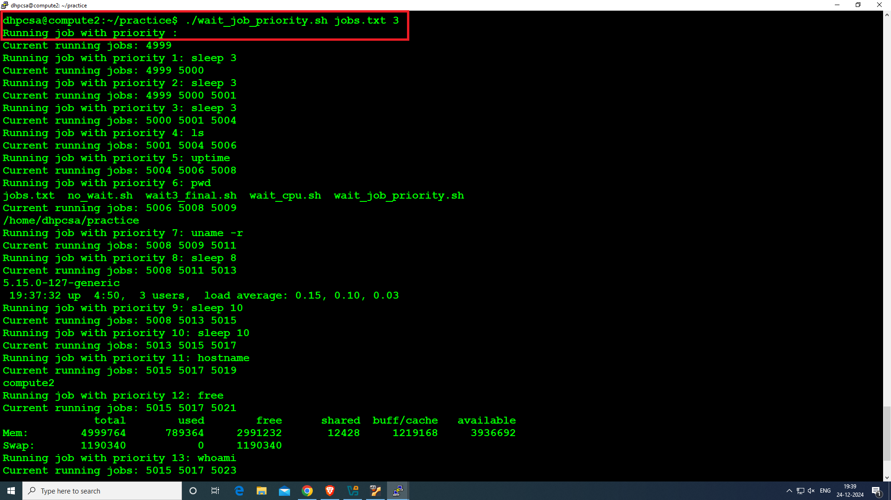

# Job Scheduler with Priority and Concurrency Limitation

<br>

## Overview


**This Bash script implements a job scheduler that reads jobs from a text file, assigns priorities to each job, and executes them in a manner where the jobs are processed based on their priority. The script also controls the number of concurrent jobs that can run simultaneously. The jobs are sorted based on their priority and executed one by one while ensuring that the system does not exceed the specified number of concurrent jobs at any given time.**

<br>

## Scenario Example:

**Suppose you have thousands of nodes and repetitive daily tasks, like running certain commands on each node. This script can efficiently handle these tasks by automating job execution across nodes, prioritizing tasks as needed, and speeding up the process by running multiple jobs concurrently on all nodes. This saves significant time and effort compared to manual execution.**

*The scheduler uses a basic priority system where lower numerical values represent higher priority. It ensures that at most a specified number of jobs are executed concurrently. It also tracks the jobs being run and waits for them to complete before starting new ones.*

## Features

1. **Job Priority Management:** Jobs are executed based on their assigned priority (the lowest number is the highest priority).

2. **Concurrency Limitation:** Limits the number of jobs that can run concurrently, preventing the system from being overloaded.

3. **Dynamic Job Management:** Continuously checks for running jobs, ensuring no more than the specified number of jobs run at once.

4. **Job Execution:** The script supports any command passed to it, allowing flexibility in what jobs can be executed.


## Use Case


*This script is an invaluable tool for scenarios where multiple jobs (commands) need to be executed efficiently, reliably, and with controlled resource usage. Its flexibility and automation capabilities make it applicable in a variety of critical tasks, including:*

- Managing Large-Scale Systems: Perfect for environments with thousands of nodes, where repetitive tasks like updates, log cleanups, or status checks must be executed daily. By running multiple jobs concurrently, the script minimizes the time required to maintain all nodes.

- Executing Resource-Intensive System Commands: Automates the execution of resource-heavy system commands or scripts without overwhelming the system by limiting the number of concurrent processes.

- Batch Processing with Prioritization: Ensures high-priority tasks are processed first while lower-priority jobs are queued and executed without delays, optimizing task execution order.

- Preventing System Overload: Allows administrators to define the maximum number of concurrent jobs, ensuring system stability and avoiding performance degradation due to excessive resource usage.


<br>
  

## Why This Script is Essential:

- Saves significant time by parallelizing job execution.
- Reduces manual effort through automation of repetitive and routine tasks.
- Enhances reliability by managing job priorities and limiting concurrent resource utilization.
- Provides scalability for distributed systems or large infrastructures, making it ideal for - both small-scale and enterprise-level operations.

***With its ability to handle thousands of jobs efficiently and prioritize critical tasks, this script becomes an indispensable tool for system administrators, data engineers, and anyone managing large-scale operations or batch processes.***


<br>


# How It Works

1. Reads Input:

    - The script reads the jobs.txt file line by line.
    - Each line is parsed to extract the priority and command.

2. Sorts by Priority:

    - Jobs are sorted in ascending order based on their priority (lower numbers indicate higher priority).

3. Executes Jobs:

    - Jobs are executed in the order of priority.
    - Limits the number of concurrently running jobs to the specified maximum.

4. Manages Concurrency:

    - Tracks running jobs using process IDs (PIDs).
    - Waits for running jobs to complete before starting new ones if the concurrency limit is reached.

5. Completion:

    - Ensures all jobs are completed before exiting.


<br>

# ***********************************************************************

<br>


## Main Script:

```yml

#!/bin/bash

# Function to execute jobs with priority and concurrency management
function runme() {
    local file=$1
    local max_concurrent_jobs=$2
    jobs_arr=()

    # Read and parse jobs file
    while read -r line; do
        priority=$(echo "$line" | cut -d ' ' -f1)
        command=$(echo "$line" | cut -d ' ' -f2-)
        jobs_arr+=("$priority $command")
    done < "$file"

    # Sort jobs by priority (ascending)
    IFS=$'\n' sorted_jobs=($(sort -n -k1 <<<"${jobs_arr[*]}"))
    unset IFS

    pids=() # Array to store process IDs

    # Execute jobs
    for ((i = 0; i < ${#sorted_jobs[@]}; i++)); do
        # Limit concurrent jobs
        while [ ${#pids[@]} -ge $max_concurrent_jobs ]; do
            for pid in "${pids[@]}"; do
                if ! kill -0 "$pid" 2>/dev/null; then
                    pids=(${pids[@]/$pid})
                    break
                fi
            done
        done

        # Extract priority and command
        job_info=(${sorted_jobs[$i]})
        priority=${job_info[0]}
        command="${job_info[@]:1}"

        # Run the job
        echo "Running job with priority $priority: $command"
        eval "$command" & # Background execution
        pids+=("$!") # Store PID

        echo "Current running jobs: ${pids[@]}"
    done

    # Wait for all jobs to finish
    wait
}

# Validate input arguments
if [ "$#" -lt 2 ]; then
    echo "Usage: $0 <file_with_jobs_and_priorities> <max_concurrent_jobs>"
    exit 1
fi

# Execute function and measure time
time runme "$1" "$2"


```


<br>


## Example jobs.txt file
  - Each line in the file follows the format:
    
    - 'priority'   'command'


### Sample:

```yml


# <priority> <command>

8 sleep 8
9 sleep 10
6 pwd
7 uname -r
1 sleep 3
2 sleep 3
3 sleep 3
4 ls
11 hostname
13 whoami
12 free
5 uptime
14 hostname -I


```


<br>


## Steps to Run
1. Create the Script: Save the script above to a file,
     - For example, priority_jobs.sh.

3. Make the Script Executable:
     - Run the following command to make the script executable:

```yml
chmod +x priority_jobs.sh
```

3. Prepare the jobs.txt File:
     -  Create a jobs.txt file in the same directory as the script, and copy the example content above into it (for demo).

5. Run the Script:
     - Execute the script with the jobs.txt file and the maximum number of concurrent jobs as arguments:

```yml
./priority_jobs.sh jobs.txt 3
```

  - *This will run the jobs in jobs.txt, ensuring no more than 3 jobs are running at the same time.(You can increase or decrease )*


<br>


<br>


# Practical Scenarios for Using the Bash Job Scheduler

<br>


***This Bash job scheduler script can be applied in various real-world scenarios where managing and executing multiple tasks with priority and concurrency limits is essential. Below are a few practical use cases:***


<br>


## 1. Large-Scale Node Management in Distributed Systems
Use Case: Managing thousands of servers or IoT devices where repetitive tasks like log cleanup, configuration updates, and status checks need to be performed daily.

Example Job File (jobs.txt):

```yml
1 ssh node1 'df -h && sudo apt update'  
2 ssh node2 'df -h && sudo apt update'  
3 ssh node3 'df -h && sudo apt update'  
4 ssh node4 'df -h && sudo apt update'
```

  ### Scenario:

- Tasks are executed based on their priority.
  
- Jobs for each node can run concurrently, with a user-defined limit on how many jobs are processed simultaneously (e.g., 10 nodes at a time).

- Make sure Passwordless ssh is cofigured on all Nodes.


<br>


## 2. System Administration and Maintenance Tasks

  - **Use Case:** System administrators often run tasks like system diagnostics, software updates, and cleanups. These tasks have varying priorities and resource requirements.

### Example Job File (jobs.txt):


```yml
1 df -h  
2 free -m  
3 sudo apt update  
4 sudo apt upgrade -y  
5 dmesg | tail
```

   ### Scenario:

- High-priority jobs (e.g., updates) execute first, ensuring system stability.
  
- Concurrently, less resource-intensive jobs (e.g., dmesg) run.

<br>


## 3. Batch Processing Jobs (Small-scale Data Processing)
  - **Use Case:** A data engineer processes CSV files using Python scripts, prioritizing smaller files to reduce processing delays.

### Example Job File (jobs.txt):

```yml

1 python process_small_file.py file1.csv  
2 python process_large_file.py file2.csv  
3 python process_small_file.py file3.csv  
4 python process_large_file.py file4.csv

```

  ### Scenario:

- Smaller files (priority 1 and 3) are processed first.
  
- Larger files (priority 2 and 4) are queued but run concurrently to avoid delays.


<br>


### 4. Automating Test Runs in Development Environments

  - **Use Case:** Developers run unit, integration, and end-to-end tests with varying priorities and resource needs.

### Example Job File (jobs.txt):

```yml
1 pytest test_unit_1.py  
1 pytest test_unit_2.py  
2 pytest test_integration_1.py  
2 pytest test_integration_2.py  
3 pytest test_end_to_end.py
```

  ### Scenario:

  - Quick unit tests (priority 1) run first.
    
  - Resource-intensive integration and end-to-end tests (priority 2 and 3) follow, with limited concurrent execution.


<br>


## 5. Data Backup and Cleanup Operations
  - **Use Case:** A system needs to back up data, clean logs, and delete old files, prioritizing backups.

### Example Job File (jobs.txt):

```yml
1 rsync -av /important_data /backup_location  
2 rm -rf /var/log/*.log  
3 find /home/user/old_files -type f -mtime +30 -exec rm {} \;
```
  ### Scenario:

- Backup tasks (priority 1) are completed first.
  
- Cleanup operations (priority 2 and 3) run concurrently but within defined limits.


<br>


## 6. Job Scheduling for Small Servers or IoT Devices
  - **Use Case:** Resource-limited devices execute maintenance and monitoring tasks.

### Example Job File (jobs.txt):

```yml
1 python check_sensors.py  
2 cp /var/log/syslog /backup/syslog  
3 sudo apt update && sudo apt upgrade -y  
4 python monitor_network.py
```
  ### Scenario:

- Critical tasks (e.g., check_sensors.py) run first, ensuring reliable monitoring.
  
- Concurrency is limited to prevent overloading small devices.


<br>


## 7. Automated Resource-Intensive Jobs with Priority Control
 -  **Use Case:** A data scientist runs multiple ML training jobs, prioritizing smaller datasets.

### Example Job File (jobs.txt):

```yml
1 python train_model_small.py  
2 python train_model_medium.py  
3 python train_model_large.py
```

  ### Scenario:

- Smaller models (priority 1) train first for faster results.
  
- Larger models (priority 2 and 3) train concurrently but within resource limits.

<br>


## 8. Cloud and Virtualization Management
  - **Use Case:** Cloud administrators automate instance creation, configuration, and testing tasks.

### Example Job File (jobs.txt):

```yml
1 terraform apply -var-file=prod.tfvars  
2 ansible-playbook -i prod_inventory setup.yml  
3 terraform destroy -var-file=prod.tfvars
```

  ### Scenario:

- VM creation (priority 1) is completed first.
  
- Setup and cleanup tasks (priority 2 and 3) follow with concurrency limits to prevent overloading cloud resources.


<br>
<br>

## Conclusion
**This Bash job scheduler script is a versatile tool for managing tasks with priorities and concurrency controls. By allowing users to define how many jobs can run concurrently, it ensures efficient resource utilization and minimizes execution time. It is particularly useful for system administration, data processing, development testing, backup operations, and resource management in environments with limited capacity.**


<br>
<br>

<br>
<br>


## ------------------Screnshots--------------------
1.
<br>
<br>


2.
<br>
<br>


<br>
<br>

3.
<br>
<br>


4.
<br>
<br>


5.
<br>
<br>




6.
<br>
<br>


7.
<br>
<br>


8.
<br>
<br>


9.
<br>
<br>


10.
<br>
<br>


<br>
<br>


11.
<br>
<br>


<br>
<br>


<br>
<br>
<br>
<br>


**👨‍💻 𝓒𝓻𝓪𝓯𝓽𝓮𝓭 𝓫𝔂**: [Suraj Kumar Choudhary](https://github.com/Surajkumar4-source) | 📩 **𝓕𝓮𝓮𝓵 𝓯𝓻𝓮𝓮 𝓽𝓸 𝓓𝓜 𝓯𝓸𝓻 𝓪𝓷𝔂 𝓱𝓮𝓵𝓹**: [csuraj982@gmail.com](mailto:csuraj982@gmail.com)


<br>


